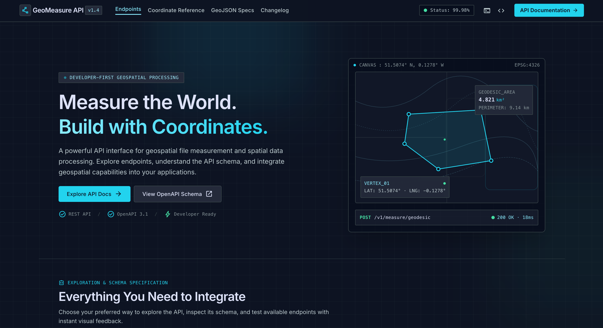

<a id="readme-top"></a>

[![Contributors][contributors-shield]][contributors-url]
[![Forks][forks-shield]][forks-url]
[![Stargazers][stars-shield]][stars-url]
[![Issues][issues-shield]][issues-url]
[![LinkedIn][linkedin-shield]][linkedin-url]

<!-- PROJECT HEADER -->
<br />
<div align="center">
    <a href="https://geospatial-file-measurement-api-5rlq.onrender.com/">
        
    </a>
  <h3 align="center">Geospatial File Measurement API</h3>

  <p align="center">
    A FastAPI backend that accepts a KML or a zipped Shapefile, extracts every feature, and returns accurate area and length measurements in metres.
    <br />
    <a href="https://geospatial-file-measurement-api-5rlq.onrender.com/docs">Live API Docs</a>
    ·
    <a href="https://github.com/akash85246/Geospatial-File-Measurement-API/issues/new?labels=bug">Report Bug</a>
    ·
    <a href="https://github.com/akash85246/Geospatial-File-Measurement-API/issues/new?labels=enhancement">Request Feature</a>
  </p>
</div>

<!-- TABLE OF CONTENTS -->
<details>
  <summary>Table of Contents</summary>
  <ol>
    <li>
      <a href="#about-the-project">About The Project</a>
      <ul>
        <li><a href="#features">Features</a></li>
        <li><a href="#built-with">Built With</a></li>
      </ul>
    </li>
    <li>
      <a href="#getting-started">Getting Started</a>
      <ul>
        <li><a href="#prerequisites">Prerequisites</a></li>
        <li><a href="#installation">Installation</a></li>
        <li><a href="#configuration">Configuration</a></li>
        <li><a href="#deploying-to-render">Deploying to Render</a></li>
      </ul>
    </li>
    <li>
      <a href="#api">API</a>
      <ul>
        <li><a href="#upload-a-file">Upload a file</a></li>
        <li><a href="#get-file-information">Get file information</a></li>
        <li><a href="#get-measurements">Get measurements</a></li>
        <li><a href="#get-features">Get features</a></li>
        <li><a href="#error-responses">Error responses</a></li>
      </ul>
    </li>
    <li>
      <a href="#architecture">Architecture</a>
      <ul>
        <li><a href="#application-structure">Application structure</a></li>
        <li><a href="#file-processing-flow">File-processing flow</a></li>
        <li><a href="#measurement-flow">Measurement flow</a></li>
        <li><a href="#crs-handling">CRS handling</a></li>
        <li><a href="#data-model">Data model</a></li>
      </ul>
    </li>
    <li><a href="#design-decisions">Design Decisions</a></li>
    <li><a href="#known-limitations">Known Limitations</a></li>
    <li><a href="#testing-with-the-sample-files">Testing with the Sample Files</a></li>
    <li><a href="#learnings">Learnings</a></li>
    <li><a href="#future-scope">Future Scope</a></li>
    <li><a href="#contact">Contact</a></li>
    <li><a href="#acknowledgments">Acknowledgments</a></li>
  </ol>
</details>

<!-- ABOUT THE PROJECT -->

## About The Project

Surveyors and GIS teams often hand over map files and need to know "how big is each parcel, how long is each road". This service takes that file, reads every shape in it, and answers with real-world measurements: square metres for polygons, metres for lines.

The core challenge is **coordinate systems**. KML files (and many Shapefiles) store positions as latitude/longitude **degrees**, and a "square degree" or "degree of distance" is meaningless. The service never measures in degrees: every geographic geometry is reprojected to a metric projected CRS (the matching UTM zone) before area or length is calculated.

Built with Python, FastAPI and GeoPandas. Uploaded files and their features are stored in SQLite through SQLAlchemy.

### Features

- **Two input formats**: `.kml` and `.zip` containing one or more Shapefiles.
- **Full feature extraction**: for every feature the API stores and returns the index, geometry type, geometry (WKT), CRS and all attributes.
- **Correct measurements**: polygon area (m²), line length (m), including multi-part geometries and polygons with holes.
- **Automatic CRS handling**: geographic coordinates are reprojected to the UTM zone of each feature; projected CRSs are measured in their own units (feet and other units are converted to metres).
- **Graceful degradation**: empty, invalid and unsupported geometries never crash the request. They come back with no measurement and a human-readable `note`.
- **Safe uploads**: file-type check, 50 MB size limit, corrupt-zip detection, zip-slip (path traversal) protection and a zip-bomb guard.
- **Processing status**: every upload has a `PENDING / PROCESSING / COMPLETED / FAILED` status and an error message on failure.
- **Interactive documentation**: landing page at `/`, Swagger UI at `/docs`, ReDoc at `/redoc`.

<p align="right">(<a href="#readme-top">back to top</a>)</p>

### Built With

- [![Python][Python]][Python-url]
- [![FastAPI][FastAPI]][FastAPI-url]
- [![SQLAlchemy][SQLAlchemy]][SQLAlchemy-url]
- [![SQLite][SQLite]][SQLite-url]
- [![GeoPandas][GeoPandas]][GeoPandas-url]
- [![Shapely][Shapely]][Shapely-url]
- [![pyproj][pyproj]][pyproj-url]
- [![Uvicorn][Uvicorn]][Uvicorn-url]
- [![Render][Render]][Render-url]
- [![Git][Git]][Git-url]
- [![GitHub][GitHub]][GitHub-url]

<p align="right">(<a href="#readme-top">back to top</a>)</p>

<!-- GETTING STARTED -->

## Getting Started

Follow these steps to run the API on your own machine.

### Prerequisites

- **Python 3.11 or newer** (developed on Python 3.14).
- **Git**, to clone the repository.
- No system GDAL or PROJ install is needed. The `pyogrio` and `pyproj` wheels bundle them.

### Installation

1. **Clone the repository**

   ```bash
   git clone https://github.com/akash85246/Geospatial-File-Measurement-API.git
   cd Geospatial-File-Measurement-API
   ```

2. **Run it**

   The quickest way is the included script. It creates a `.venv`, installs the dependencies and starts the server:

   ```bash
   chmod +x start.sh
   ./start.sh
   ```

   Or do the same steps manually:

   ```bash
   python3 -m venv .venv
   source .venv/bin/activate          # Windows: .venv\Scripts\activate
   python -m pip install -r requirements.txt
   python -m uvicorn app.main:app --reload
   ```

3. **Open the API**

   | URL                         | What it is                                                |
   | --------------------------- | --------------------------------------------------------- |
   | http://127.0.0.1:8000/      | Landing page with links and a quick-start                 |
   | http://127.0.0.1:8000/docs  | Interactive Swagger UI (try the endpoints in the browser) |
   | http://127.0.0.1:8000/redoc | ReDoc reference                                           |

   The SQLite database file (`geofiles.db`) and its tables are created automatically on first start. There are no migrations to run.

### Configuration

All settings are optional environment variables.

| Variable          | Default                   | Purpose                                                                                                                 |
| ----------------- | ------------------------- | ----------------------------------------------------------------------------------------------------------------------- |
| `DATABASE_URL`    | `sqlite:///./geofiles.db` | SQLAlchemy connection string. Change it to point at another database.                                                   |
| `PUBLIC_BASE_URL` | derived from the request  | Public address shown in the landing page examples, e.g. `https://my-api.onrender.com`. Only needed behind some proxies.                                                                                               |

### Deploying to Render

Create a **Web Service** from the repository with these settings:

- **Build Command**: `pip install -r requirements.txt`
- **Start Command**: `uvicorn app.main:app --host 0.0.0.0 --port $PORT --proxy-headers --forwarded-allow-ips='*'`

Render requires the server to listen on `0.0.0.0` and on the port given in `$PORT`. The proxy flags let the app see the public `https://` address. If the default Python version is too old for the pinned dependencies, set a `PYTHON_VERSION` environment variable.

<p align="right">(<a href="#readme-top">back to top</a>)</p>

<!-- API -->

## API

Base URL: `http://127.0.0.1:8000` locally, or your deployed URL. Full interactive documentation is always available at `/docs`.

| Method | Endpoint                        | Description                                                    |
| ------ | ------------------------------- | -------------------------------------------------------------- |
| `POST` | `/api/files/`                   | Upload and process a `.kml` or a `.zip` containing a Shapefile |
| `GET`  | `/api/files/{id}/`              | File summary: filename, feature count, CRS, status             |
| `GET`  | `/api/files/{id}/measurements/` | Area or length for every feature                               |
| `GET`  | `/api/files/{id}/features/`     | Geometry, CRS and properties for every feature                 |

### Upload a file

`POST /api/files/` with a multipart form field named `file`.

```bash
curl -X POST "http://127.0.0.1:8000/api/files/" \
  -F "file=@samples/01_valid_mixed.kml"
```

Response `201 Created`:

```json
{
  "id": "3f2b8c1d9e7a4b6f8a0c5d1e2f3a4b5c",
  "filename": "01_valid_mixed.kml",
  "feature_count": 4,
  "crs": "EPSG:4326",
  "status": "COMPLETED",
  "error_message": null
}
```

Processing happens during the request, so a `COMPLETED` status means the measurements are ready. If the file's features use more than one CRS, the file-level `crs` is `"MIXED"` and each feature keeps its own CRS.

### Get file information

`GET /api/files/{id}/`

```bash
curl "http://127.0.0.1:8000/api/files/3f2b8c1d9e7a4b6f8a0c5d1e2f3a4b5c/"
```

```json
{
  "id": "3f2b8c1d9e7a4b6f8a0c5d1e2f3a4b5c",
  "filename": "01_valid_mixed.kml",
  "feature_count": 4,
  "crs": "EPSG:4326",
  "status": "COMPLETED",
  "error_message": null
}
```

### Get measurements

`GET /api/files/{id}/measurements/`

The example below comes from uploading `samples/10_utm_projected.zip`, a projected Shapefile with two parcels, two roads and one well.

```bash
curl "http://127.0.0.1:8000/api/files/a91d0c47e2b84f6d9c3e5a7b1d2f4e60/measurements/"
```

```json
{
  "file_id": "a91d0c47e2b84f6d9c3e5a7b1d2f4e60",
  "count": 5,
  "measurements": [
    {
      "feature_index": 0,
      "geometry_type": "Polygon",
      "crs": "EPSG:32643",
      "measurement_type": "area",
      "value": 5000.0,
      "unit": "m2",
      "note": null
    },
    {
      "feature_index": 1,
      "geometry_type": "Polygon",
      "crs": "EPSG:32643",
      "measurement_type": "area",
      "value": 37500.0,
      "unit": "m2",
      "note": null
    },
    {
      "feature_index": 2,
      "geometry_type": "LineString",
      "crs": "EPSG:32643",
      "measurement_type": "length",
      "value": 500.0,
      "unit": "m",
      "note": null
    },
    {
      "feature_index": 3,
      "geometry_type": "LineString",
      "crs": "EPSG:32643",
      "measurement_type": "length",
      "value": 300.0,
      "unit": "m",
      "note": null
    },
    {
      "feature_index": 4,
      "geometry_type": "Point",
      "crs": "EPSG:32643",
      "measurement_type": null,
      "value": null,
      "unit": null,
      "note": "No measurement defined for point geometries"
    }
  ]
}
```

Feature 1 is a 200 m × 200 m parcel with a 50 m × 50 m hole, so its area is 40,000 − 2,500 = 37,500 m². Values are rounded to 4 decimal places.

### Get features

`GET /api/files/{id}/features/` returns the extracted data for every feature: index, geometry type, geometry as WKT (2D), CRS and the original attributes. Two of the five features from the example above:

```json
{
  "file_id": "a91d0c47e2b84f6d9c3e5a7b1d2f4e60",
  "count": 5,
  "features": [
    {
      "feature_index": 2,
      "geometry_type": "LineString",
      "geometry_wkt": "LINESTRING (500000 2050100, 500300 2050500)",
      "crs": "EPSG:32643",
      "properties": { "NAME": "Road 1", "LANES": 2 }
    },
    {
      "feature_index": 4,
      "geometry_type": "Point",
      "geometry_wkt": "POINT (500050 2050025)",
      "crs": "EPSG:32643",
      "properties": { "NAME": "Well 1", "DEPTH_M": 42.5 }
    }
  ]
}
```

For KML files with more than one folder (layer), each feature also gets a `layer` property.

### Error responses

| Status | When                                                                  | Body                                                                                               |
| ------ | --------------------------------------------------------------------- | -------------------------------------------------------------------------------------------------- |
| `400`  | Wrong file extension                                                  | `{"detail": "Only .kml or .zip (containing a Shapefile) files are supported"}`                     |
| `400`  | The file cannot be used (see below)                                   | `{"id": "...", "status": "FAILED", "error_message": "..."}`                                        |
| `404`  | Unknown file id                                                       | `{"detail": "File not found"}`                                                                     |
| `409`  | Measurements or features requested for a file that is not `COMPLETED` | `{"detail": "File is FAILED; no measurements available"}`                                          |
| `500`  | Unexpected server error (logged server-side)                          | `{"id": "...", "status": "FAILED", "error_message": "Unexpected error while processing the file"}` |

A `400` with a `FAILED` body is also saved, so `GET /api/files/{id}/` shows the same status and message. The `error_message` is one of:

- `Uploaded file is empty.`
- `File too large (limit 50 MB).`
- `Invalid or corrupt zip file.`
- `Zip contains an unsafe path.`
- `Zip archive is too large when uncompressed.`
- `Zip does not contain a .shp file.`
- `Could not read shapefile '<name>': ...`
- `Could not read KML: ...`
- `KML contains no layers.` / `No features found in the file.`
- `Shapefile has no CRS (.prj missing) and coordinates do not look like lon/lat.`

<p align="right">(<a href="#readme-top">back to top</a>)</p>

<!-- ARCHITECTURE -->

## Architecture

### Application structure

```
.
├── app/
│   ├── main.py            # FastAPI app and route handlers
│   ├── database.py        # SQLAlchemy engine, session, Base
│   ├── models.py          # ORM tables: UploadedFile, Feature
│   ├── schemas.py         # Pydantic response models
│   ├── landing.py         # HTML for the landing page at /
│   └── api/
│   │   ├── __init__.py
│   │   └── urls.py        # URL defined here
│   └── views/
│   │   ├── __init__.py
│   │   └── files.py       # Contains the working of urls
│   └── services/
│       ├── __init__.py
│       ├── file_parser.py # Upload validation, zip/KML/Shapefile reading, feature building
│       ├── geometry.py    # CRS helpers: UTM zone selection, metric projection
│       └── measurement.py # Which geometry gets which measurement
├── .gitignore
├── LICENSE
├── requirements.txt
└── start.sh
```

The routes in `main.py` stay thin: they validate the request, call `services.process_file`, and save the result. All geospatial logic lives in `services/`, split into three modules with one job each, so each can be tested on its own without a web server.

### File-processing flow


### Measurement flow


| Geometry                                                   | Result                                                                      |
| ---------------------------------------------------------- | --------------------------------------------------------------------------- |
| `Polygon`, `MultiPolygon`                                  | `area` in `m2` (holes subtracted, parts summed)                             |
| `LineString`, `LinearRing`, `MultiLineString`              | `length` in `m` (parts summed)                                              |
| `Point`, `MultiPoint`                                      | no measurement, with a note                                                 |
| Anything else (for example `GeometryCollection`)           | no measurement, note `Unsupported geometry type for measurement: <type>`    |
| Empty or missing geometry                                  | geometry type `Empty`, no measurement, note                                 |
| Invalid geometry (for example a self-intersecting polygon) | still measured, with note `Invalid geometry; measurement may be inaccurate` |

An error while measuring one feature is caught and recorded as a note on that feature. One bad feature never fails the whole file.

### CRS handling

The rule: **never measure in degrees.**

| Input CRS                                              | What happens                                                                                                                                                                      |
| ------------------------------------------------------ | --------------------------------------------------------------------------------------------------------------------------------------------------------------------------------- |
| Geographic (EPSG:4326 or any other lon/lat CRS)        | The geometry is converted to WGS84 if needed, the UTM zone is chosen from the feature's centroid, the geometry is projected to that zone, and the measurement is taken in metres. |
| Projected (for example a UTM or state-plane Shapefile) | Measured directly in its own CRS. The axis unit is converted to metres (feet use a factor of 0.3048), so there is no needless reprojection.                                       |
| KML without a CRS                                      | Assumed EPSG:4326, which is the KML standard. The feature note records the assumption.                                                                                            |
| Shapefile without a `.prj`                             | If every coordinate fits within lon/lat ranges it is assumed EPSG:4326 (noted on each feature). Otherwise the upload is rejected with a `400` rather than guessing.               |
| Several layers or Shapefiles with different CRSs       | Each is measured in its own CRS. The file-level `crs` is `MIXED`.                                                                                                                 |

**Choosing the UTM zone.** The zone comes from the centroid's longitude and latitude:

```
zone = floor((longitude + 180) / 6) + 1
EPSG = 32600 + zone   (northern hemisphere)
EPSG = 32700 + zone   (southern hemisphere)
```

For example, a parcel at 73.85° E, 18.52° N is in zone 43 north (`EPSG:32643`), and a plot at 151.2° E, 33.87° S is in zone 56 south (`EPSG:32756`). North of 84° N and south of 80° S, where UTM is not defined, the polar stereographic systems (`EPSG:32661` and `EPSG:32761`) are used.

### Data model

| Table      | Columns                                                                                                                                                                 |
| ---------- | ----------------------------------------------------------------------------------------------------------------------------------------------------------------------- |
| `files`    | `id` (UUID hex), `filename`, `status`, `crs`, `feature_count`, `error_message`, `created_at`                                                                            |
| `features` | `id`, `file_id` (FK), `feature_index`, `geometry_type`, `geometry_wkt`, `crs`, `properties` (JSON), `measurement_type`, `measurement_value`, `measurement_unit`, `note` |

Features are returned in file order. Deleting a file record cascades to its features.

<p align="right">(<a href="#readme-top">back to top</a>)</p>

<!-- DESIGN DECISIONS -->

## Design Decisions

**FastAPI instead of Django + DRF.**
The assignment allows either. FastAPI needs far less boilerplate for a small API, generates the OpenAPI documentation and Swagger UI automatically, and validates responses with Pydantic. Django would have added an ORM, admin, migrations and settings that this service does not use.

**SQLite + SQLAlchemy instead of PostgreSQL/PostGIS.**
SQLite needs no server, so anyone can run the project with zero setup. Geometries are stored as WKT text because the service never runs spatial queries. SQLAlchemy keeps the door open: pointing `DATABASE_URL` at PostgreSQL is a configuration change, and PostGIS would be the natural next step if spatial queries were ever needed.

**Synchronous endpoints and synchronous processing.**
GeoPandas and GDAL are blocking, so `async` endpoints would gain nothing. Plain `def` endpoints are run in FastAPI's thread pool. Files are processed inside the upload request, which keeps the flow simple and lets the `201` response already carry the final status. The `status` field is deliberately there so processing can move to a background worker later without changing the API.

**UTM zone per feature instead of one projection for everything.**
Alternatives considered:

| Option                                        | Why it was not chosen                                                                                                                               |
| --------------------------------------------- | --------------------------------------------------------------------------------------------------------------------------------------------------- |
| Single equal-area CRS (for example EPSG:6933) | Accurate for area but not for length, and distorts more at small scales than a local UTM zone.                                                      |
| Geodesic calculation with `pyproj.Geod`       | The most accurate (no projection at all) and the best future upgrade, but it needs separate handling for polygons with holes and multi-part shapes. |
| One UTM zone per file                         | A file that spans several zones would be measured with large distortion in some features.                                                           |

UTM is a good fit for survey-scale data: the error is small within a zone, and the result is directly in metres. Choosing the zone per feature keeps files that span zones accurate.

**Measure projected CRSs natively, with unit conversion.**
If a Shapefile is already in a metric projected CRS there is no reason to reproject it, so it is measured as it is. The axis unit factor handles feet and other units.

**`pyogrio` through GeoPandas instead of Fiona.**
`pyogrio` wheels bundle GDAL, so there is no system install, which removes the most common setup failure. It is also faster for reading.

**Fail one feature, not the whole file.**
Empty, invalid, unsupported and unmeasurable features are returned with a `note`. Only problems with the file itself (corrupt, no CRS, nothing readable) fail the upload, with a `400` and a stored reason.

**Defensive upload handling.**
The file is streamed to disk with a size cap rather than read into memory, zip entries are validated before extraction, and the uncompressed size is capped. Server errors return a generic message while the real error is logged.

<p align="right">(<a href="#readme-top">back to top</a>)</p>

<!-- KNOWN LIMITATIONS -->

## Known Limitations

- **UTM distortion.** UTM scale error is up to about 0.1% in length (about 0.2% in area) near the edge of a zone. Fine for survey-scale data, but a geodesic calculation would remove it.
- **Very large or multi-zone shapes.** A single polygon that spans several UTM zones, or a country-sized polygon, is measured in one zone and loses accuracy.
- **Antimeridian.** Shapes that cross the 180° meridian are not handled specially.
- **Projected CRSs are measured natively.** This is correct for metric, locally accurate projections such as UTM. A projection that is not area-preserving (for example Web Mercator, EPSG:3857) overstates areas away from the equator, so such files should be reprojected first.
- **Invalid geometries are measured as they are.** They are flagged with a note, but a self-intersecting polygon can yield a misleading area.
- **Ephemeral storage on free hosting.** See [Deploying to Render](#deploying-to-render).

<p align="right">(<a href="#readme-top">back to top</a>)</p>

<!-- TESTING -->

## Testing with the Sample Files

## Sample Files and Testing

The `samples/` folder contains three files used to test the geospatial file measurement API:

* `01_valid_mixed.kml` — a KML file containing mixed geometry types.
* `10_utm_projected.zip` — a ZIP archive containing projected geospatial data using a UTM coordinate reference system.
* `geo_samples_bundle.zip` — a ZIP archive containing geospatial sample data for testing file processing.

These files are used to verify that the API can accept uploaded KML and ZIP files, process their geospatial data, resolve coordinate reference systems (CRSs), and calculate measurements where applicable.

The current testing covers only these three files. Additional test cases, such as 3D coordinates, self-intersecting polygons, missing `.prj` files, null or multipart geometries, mixed CRSs, malicious ZIP archives, corrupt ZIP files, and empty uploads, have not been independently verified unless explicitly tested.

Files can also be uploaded and tested interactively through the Swagger UI at `/docs`.

<p align="right">(<a href="#readme-top">back to top</a>)</p>

<!-- LEARNINGS -->

## Learnings

- **Degrees are not distances.** The same 0.01° × 0.01° square is about 1.23 km² at the equator but only about 0.45 km² at 69° N. The sample `06_same_degrees_different_area.kml` exists to show this, and it shaped the whole CRS design.
- **A CRS is more than an EPSG code.** Handling feet, missing `.prj` files, geographic versus projected systems and mixed CRSs inside one upload took more design than the measuring itself.
- **Untrusted uploads need real defences.** Zip-slip, zip bombs, corrupt archives and macOS junk files are all realistic inputs, and each needed an explicit check.
- **Real files are messy.** KML folders become separate layers, KML coordinates often carry altitude, Shapefiles can contain null shapes, and attribute tables contain NaN and dates that do not serialise to JSON until they are normalised.
- **Hand-built test fixtures pay off.** Writing small KML and Shapefile inputs with known areas (a 100 m × 50 m parcel is exactly 5,000 m²) makes the measurement code easy to verify.
- **Separate "bad file" from "bad feature".** Mapping parser problems to `400` with a stored reason, and feature problems to notes, made the API behaviour predictable.
- **Deployment details matter.** Cloud hosts need the server on `0.0.0.0` and `$PORT`, proxy headers for correct public URLs, and a persistent database if data must survive restarts.

<p align="right">(<a href="#readme-top">back to top</a>)</p>

<!-- FUTURE SCOPE -->

## Future Scope

- [ ] Automated `pytest` suite and CI, built on the existing sample files and `expected.json`.
- [ ] Geodesic measurements with `pyproj.Geod` to remove UTM zone-edge distortion and handle multi-zone shapes.
- [ ] Reproject non-area-preserving projected CRSs (such as Web Mercator) to UTM before measuring.
- [ ] Background processing (for example a task queue) so large files return immediately and the client polls the status.
- [ ] PostgreSQL/PostGIS storage, enabling spatial queries and a persistent database on hosting platforms.
- [ ] Pagination and filtering on the features and measurements endpoints.
- [ ] Return geometries as GeoJSON, and support more input formats (GeoJSON, GeoPackage).
- [ ] Antimeridian handling and a warning when a shape spans several UTM zones.
- [ ] Authentication, rate limiting, and endpoints to list and delete uploaded files.
- [ ] Docker image for one-command setup.
- [ ] Database migrations with Alembic.

<p align="right">(<a href="#readme-top">back to top</a>)</p>

<!-- CONTACT -->

## Contact

Akash Rajput - [@akash_rajp91025](https://x.com/akash_rajp91025) - akash.rajput.dev@gmail.com

Project Link: [https://github.com/akash85246/Geospatial-File-Measurement-API](https://github.com/akash85246/Geospatial-File-Measurement-API)

<p align="right">(<a href="#readme-top">back to top</a>)</p>

<!-- ACKNOWLEDGMENTS -->

## Acknowledgments

- **FastAPI** - For the fast, well-documented web framework with automatic OpenAPI docs.
- **GeoPandas, pyogrio and GDAL** - For reading Shapefiles and KML with one consistent interface.
- **Shapely** - For geometry handling and validity checks.
- **pyproj and PROJ** - For reliable coordinate transformations and CRS parsing.
- **SQLAlchemy** - For the ORM and an easy path to other databases.
- **Render** - For simple deployment.
- **Best-README-Template** - For the README layout.

<p align="right">(<a href="#readme-top">back to top</a>)</p>

<!-- MARKDOWN LINKS & IMAGES -->

[contributors-shield]: https://img.shields.io/github/contributors/akash85246/Geospatial-File-Measurement-API.svg?style=for-the-badge
[contributors-url]: https://github.com/akash85246/Geospatial-File-Measurement-API/graphs/contributors
[forks-shield]: https://img.shields.io/github/forks/akash85246/Geospatial-File-Measurement-API.svg?style=for-the-badge
[forks-url]: https://github.com/akash85246/Geospatial-File-Measurement-API/network/members
[stars-shield]: https://img.shields.io/github/stars/akash85246/Geospatial-File-Measurement-API.svg?style=for-the-badge
[stars-url]: https://github.com/akash85246/Geospatial-File-Measurement-API/stargazers
[issues-shield]: https://img.shields.io/github/issues/akash85246/Geospatial-File-Measurement-API.svg?style=for-the-badge
[issues-url]: https://github.com/akash85246/Geospatial-File-Measurement-API/issues
[linkedin-shield]: https://img.shields.io/badge/-LinkedIn-black.svg?style=for-the-badge&logo=linkedin&colorB=555
[linkedin-url]: https://www.linkedin.com/in/akash-rajput-dev/
[Python]: https://img.shields.io/badge/Python-3776AB?style=for-the-badge&logo=python&logoColor=white
[Python-url]: https://www.python.org/
[FastAPI]: https://img.shields.io/badge/FastAPI-009688?style=for-the-badge&logo=fastapi&logoColor=white
[FastAPI-url]: https://fastapi.tiangolo.com/
[SQLAlchemy]: https://img.shields.io/badge/SQLAlchemy-D71F00?style=for-the-badge&logo=sqlalchemy&logoColor=white
[SQLAlchemy-url]: https://www.sqlalchemy.org/
[SQLite]: https://img.shields.io/badge/SQLite-003B57?style=for-the-badge&logo=sqlite&logoColor=white
[SQLite-url]: https://www.sqlite.org/
[GeoPandas]: https://img.shields.io/badge/GeoPandas-139C5A?style=for-the-badge&logo=pandas&logoColor=white
[GeoPandas-url]: https://geopandas.org/
[Shapely]: https://img.shields.io/badge/Shapely-2D6A4F?style=for-the-badge
[Shapely-url]: https://shapely.readthedocs.io/
[pyproj]: https://img.shields.io/badge/pyproj-1F6FEB?style=for-the-badge
[pyproj-url]: https://pyproj4.github.io/pyproj/
[Uvicorn]: https://img.shields.io/badge/Uvicorn-499848?style=for-the-badge
[Uvicorn-url]: https://www.uvicorn.org/
[Render]: https://img.shields.io/badge/Render-46E3B7?style=for-the-badge&logo=render&logoColor=black
[Render-url]: https://render.com/
[Git]: https://img.shields.io/badge/Git-F05032?style=for-the-badge&logo=git&logoColor=white
[Git-url]: https://git-scm.com/
[GitHub]: https://img.shields.io/badge/GitHub-181717?style=for-the-badge&logo=github&logoColor=white
[GitHub-url]: https://github.com/
